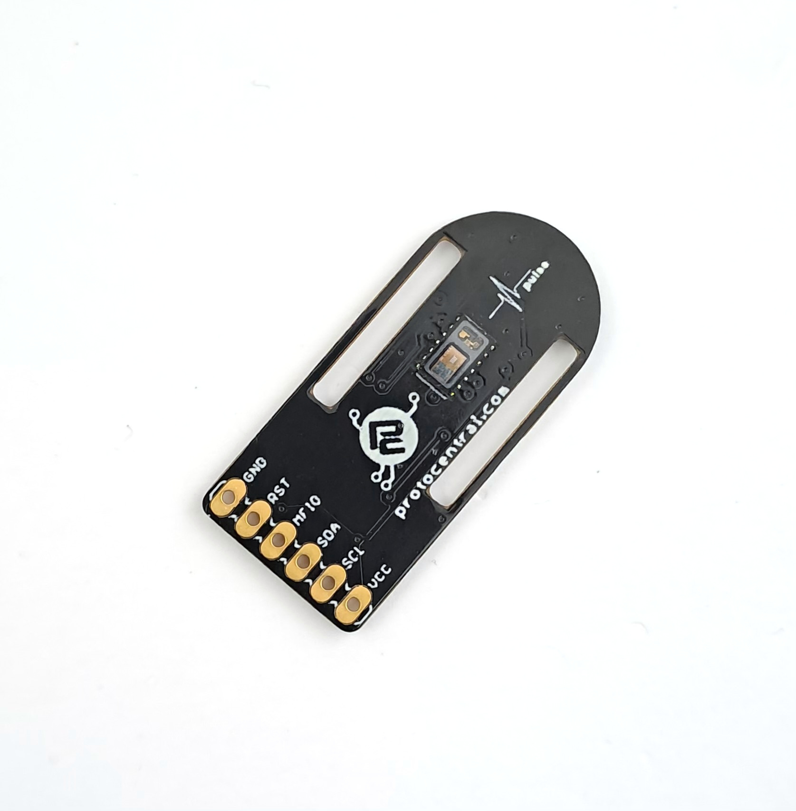

ProtoCentral Pulse Express with MAX30102 and MAX32664D
================================

[If you don't already have one, you can buy a board from here](https://protocentral.com/product/pulse-express-pulse-ox-heart-rate-sensor-with-max32664/)

Pulse Express is an efficient and versatile breakout board with integrated high-sensitivity optical sensors (MAX30102) and also a chip that does the calculations (biometric sensor hub MAX32664D). Integrating Maxim’s MAX32664 Version D makes Pulse Express unique, with an internal algorithm that works to measure different data as you start. With its built-in low power capability, the board is suitable for any wearable health for finger-based applications.

**Note: This device is only meant to be used for research & development purposes and is NOT to be used as a medical device. This product is not FDA, CE or FCC approved for consumer use.** 

Features:
* Integrates a high-sensitivity pulse oximeter and heart rate sensor (MAX30102).
* Integrated biometric sensor hub (MAX32664)
* In-built accelerometer for robust detection and compensation of motion artifacts(Optional).
* Easy-to-use I2C interface to connect to any host microcontroller.
* Ultra-Low Power
* Algorithms Measure:
  Pulse Heart Rate,
  Pulse Blood Oxygen Saturation (SpO2),
  Estimated Blood Pressure.
* Dimensions: 35 mm x 17  mm

Includes:
----------
* 1x ProtoCentral Pulse Express breakout
* 1x Welgro strap

Wiring the Breakout to your Arduino
------------------------------------
Connection with the Arduino board is as follows:
 
 |Max32664 pin label| Arduino Connection  |Pin Function      |
 |----------------- |---------------------|------------------|
 | SDA              | A4                  |  Serial Data     |
 | SCL              | A5                  |  Serial Clock    |
 | Vin              | 5V                  |  Power           |
 | GND              | Gnd                 |  Gnd             |
 | MFIO Pin         | 05                  |  MFIO            |
 | RESET Pin        | 04                  |  Reset           | 

**Instructions**

*Raw Mode*

* Make the connections as sown in the above table and upload the code
* Open serial plotter with baudrate 115200
* Place your finger on the sensor and view the ppg signal

*Algorithm mode*

* Update the spo2 calibration variables and your typical BP systolic and diastolic values in the *algorithm-mode.ino* file.
* Make the connections as sown in the above table and upload the code
* Open serial monitor and keep your finger on the sensor until calibration progress reaches 100 %
* wait for few seconds to settle the algorithm data.

License Information
===================

This product is open source! Both, our hardware and software are open source and licensed under the following licenses:

Hardware
---------

**All hardware is released under [Creative Commons Share-alike 4.0 International](http://creativecommons.org/licenses/by-sa/4.0/).**

You are free to:

* Share — copy and redistribute the material in any medium or format
* Adapt — remix, transform, and build upon the material for any purpose, even commercially.
The licensor cannot revoke these freedoms as long as you follow the license terms.

Under the following terms:

* Attribution — You must give appropriate credit, provide a link to the license, and indicate if changes were made. You may do so in any reasonable manner, but not in any way that suggests the licensor endorses you or your use.
* ShareAlike — If you remix, transform, or build upon the material, you must distribute your contributions under the same license as the original.

Software
--------

**All software is released under the MIT License(http://opensource.org/licenses/MIT).**

THE SOFTWARE IS PROVIDED "AS IS", WITHOUT WARRANTY OF ANY KIND, EXPRESS OR IMPLIED, INCLUDING BUT NOT LIMITED TO THE WARRANTIES OF MERCHANTABILITY, FITNESS FOR A PARTICULAR PURPOSE AND NONINFRINGEMENT. IN NO EVENT SHALL THE AUTHORS OR COPYRIGHT HOLDERS BE LIABLE FOR ANY CLAIM, DAMAGES OR OTHER LIABILITY, WHETHER IN AN ACTION OF CONTRACT, TORT OR OTHERWISE, ARISING FROM, OUT OF OR IN CONNECTION WITH THE SOFTWARE OR THE USE OR OTHER DEALINGS IN THE SOFTWARE.

Please check [*LICENSE.md*](LICENSE.md) for detailed license descriptions.

