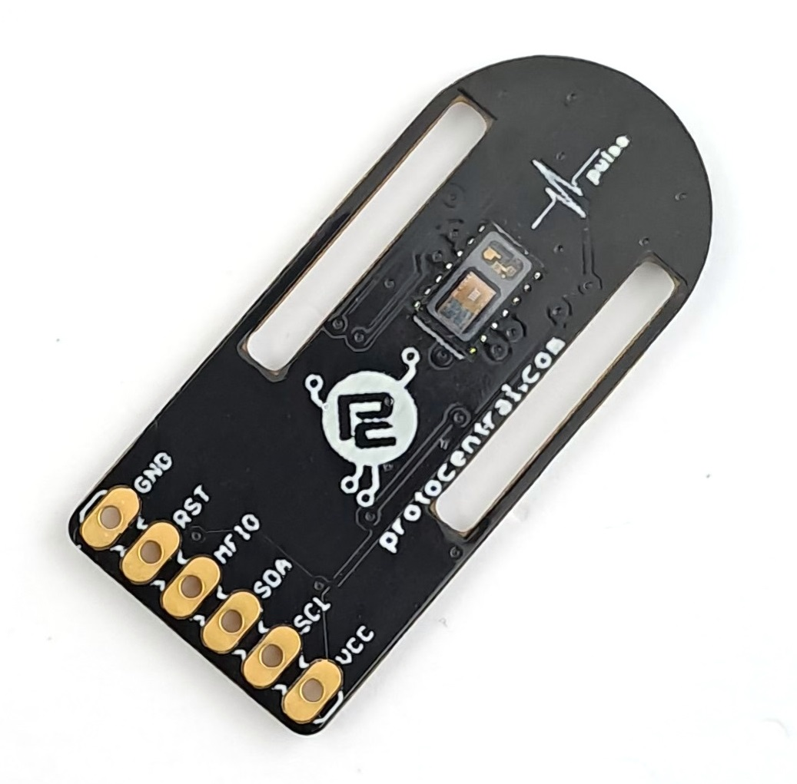

Protocentral Pulse Express with MAX30102 and MAX32664D
================================

[](https://github.com/Protocentral/protocentral-pulse-express/actions?workflow=Compile+Examples)
[](https://opensource.org/licenses/MIT)
[](https://www.arduino.cc)

## Don't have one? [Buy it here](https://protocentral.com/product/pulse-express-pulse-ox-heart-rate-sensor-with-max32664/)



Pulse Express is a compact breakout that pairs a high-sensitivity MAX30102 optical
sensor with a MAX32664D biometric sensor hub. The MAX32664D runs Maxim/ADI's
on-chip Blood-Pressure-Trending (BPT) algorithm and reports calculated heart rate,
SpO2 and blood-pressure-trend data over I2C, so the host MCU does no signal
processing. Suitable for finger-based wearable health R&D.

> **Note:** This device is for research & development only and is **NOT** a medical
> device. It is not FDA, CE or FCC approved for consumer use.

## Overview

**Key capabilities (all exposed by this library):**
- Raw PPG streaming (IR + Red, 24-bit ADC counts)
- Heart rate and SpO2 with per-reading confidence
- Blood-pressure trending — calibration → estimation (systolic / diastolic)
- SpO2 coefficient calibration (per Maxim AN6845)
- Multi-subject calibration, up to 5 subjects (firmware >= 40.5.0)
- Heart-rate variability (SDNN / RMSSD) from inter-beat intervals
- Runtime firmware-version detection and capability adaptation (40.x line)
- Factory / recovery firmware flasher for the MAX32664 bootloader

## Installation

**Arduino Library Manager (recommended):** search for *ProtoCentral Pulse Express*
and click Install.

**Manual:** download this repository as a ZIP and use
*Sketch -> Include Library -> Add .ZIP Library...* in the Arduino IDE.

## Hardware Setup

| MAX32664 pin | Arduino UNO / R4 | ESP32 (example) | Function          |
|--------------|------------------|-----------------|-------------------|
| SDA          | A4               | GPIO21          | I2C data          |
| SCL          | A5               | GPIO22          | I2C clock         |
| Vin          | 5V               | 5V / VIN        | Power             |
| GND          | GND              | GND             | Ground            |
| MFIO         | D2               | any GPIO        | Data-ready / mode |
| RESET        | D4               | any GPIO        | Hub reset         |

The RESET and MFIO pins are passed to the constructor, so any GPIOs work.


## Quick Start

```cpp
#include <Wire.h>
#include "protocentral_pulse_express.h"

PulseExpress hub(/*RESET=*/4, /*MFIO=*/2);

void setup() {
  Serial.begin(57600);
  Wire.begin();
  if (hub.begin() != PulseExpressStatus::Ok) { /* handle error */ }
  hub.startEstimation();                 // streams HR + SpO2 (BP needs calibration)
}

void loop() {
  PulseExpressSample s[8];
  size_t n = 0;
  if (hub.readSamples(s, 8, &n) == PulseExpressStatus::Ok)
    for (size_t i = 0; i < n; ++i) {
      Serial.print("HR ");    Serial.print(s[i].heartRate(), 1);
      Serial.print(" SpO2 "); Serial.println(s[i].spo2(), 1);
    }
}
```

## Firmware versions & capabilities

The MAX32664D changed its protocol across the 40.x firmware line. `begin()` reads
the hub firmware version and derives a capability set (`hub.caps()`); the driver
then adapts automatically. Notable breakpoints:

- **40.2.2+** — BP-medication / rest-mode setup steps dropped.
- **40.5.0+** — calibration vector 824 -> 512 bytes, sample 23 -> 29 bytes, date
  format YYMMDD -> YYYYMMDD, and multi-point calibration (`calIndex` 0..4).

Branch on `hub.caps().multiPointCalib` if you support both. Version checking is a
**soft warning**: `begin()` still proceeds on unexpected firmware and reports it via
`hub.firmwareSupported()`.

**Firmware is pre-installed at the factory.** Boards ship flashed and ready; you do
not need a firmware image for normal use. The MAX32664D application image (`.msbl`)
is Maxim/ADI IP and is **not** redistributed here. Re-flashing is a factory/recovery
operation — see [`examples/11.FirmwareFlash`](examples/11.FirmwareFlash) and
[`extras/`](extras/).

## Examples

| #  | Sketch | Shows |
|----|--------|-------|
| 01 | RawPPGStreamPlotter       | Raw IR PPG to Arduino Serial Plotter |
| 02 | RawPPGStreamOpenView      | Raw IR/Red to ProtoCentral OpenView GUI |
| 03 | HeartRateSpO2             | Live heart rate + SpO2 (no calibration) |
| 04 | BPTCalibration            | Run BPT calibration, dump the vector |
| 05 | BPTEstimation             | Estimate BP/HR/SpO2 from a saved vector |
| 06 | BPTCalibrateAndEstimate   | Full calibrate -> estimate, end to end |
| 07 | SaveLoadCalibrationEEPROM | Persist the vector to EEPROM, reload on boot |
| 08 | MultiSubjectCalibration   | Calibrate up to 5 subjects (FW >= 40.5.0) |
| 09 | HeartRateVariability      | SDNN / RMSSD from inter-beat intervals |
| 10 | DeviceInfoAndDiagnostics  | Firmware versions, caps, live hub status |
| 11 | FirmwareFlash             | Factory/recovery .msbl flasher |

## Hub firmware flashing (factory / recovery)

Boards ship pre-flashed — you normally never need this. To recover a hub or
change its MAX32664D firmware version, [`flash-firmware.sh`](flash-firmware.sh)
uploads the [`11.FirmwareFlash`](examples/11.FirmwareFlash) relay sketch and then
streams your `.msbl` to it:

```bash
./flash-firmware.sh --dry-run  extras/firmware/<image>.msbl   # parse only
./flash-firmware.sh --esp32 --port <PORT> extras/firmware/<image>.msbl
```

**Host board:** a page write is one 8210-byte I2C transaction, so the host's Wire
buffer must hold all of it — use an **ESP32 or RP2040**. The UNO R4 cannot flash
(its Renesas Wire caps transactions at 255 bytes); the tool detects this and
stops before erasing anything.

The `.msbl` is Maxim/ADI IP and is not distributed with this library; supply your
own. Full usage, the manual two-command path, and troubleshooting are in
[`extras/flash_tool/README.md`](extras/flash_tool/README.md).

## API Reference

Construct with the reset and MFIO pins (and optionally a `TwoWire` bus):
`PulseExpress hub(resetPin, mfioPin, Wire);`

- `begin()` — reset hub, enter application mode, read version, derive caps.
- `version()`, `algoVersion()`, `caps()`, `firmwareSupported()` — device info.
- BPT calibration: `startCalibration(...)`, `readSample(...)`, `readCalibrationVector(...)`.
- BPT estimation: `loadCalibrationVector(...)`, `startEstimation(...)`, `readSamples(...)`.
- Raw PPG: `startRaw()`, `readRaw(...)`.
- Diagnostics / teardown: `readStatus(...)`, `stop()`.

All fallible calls return `PulseExpressStatus`; compare against
`PulseExpressStatus::Ok`. See [`src/protocentral_pulse_express.h`](src/protocentral_pulse_express.h)
for the full documented API.

> **Migrating from 2.0.x:** the class was `Max32664` with `Max32664*` types. Those
> names still work via `#include "max32664.h"`. New code should use `PulseExpress`
> and `#include "protocentral_pulse_express.h"`. See [CHANGELOG.md](CHANGELOG.md).

## For further details

Refer to [the Pulse Express documentation](https://docs.protocentral.com/getting-started-with-PulseExpress).

License Information
===================


This product is open source! Both our hardware and software are open source and
licensed under the following licenses:

**Hardware** — [CERN-OHL-P v2](https://ohwr.org/cern_ohl_p_v2.txt). Copyright CERN 2020.

**Software** — [MIT License](http://opensource.org/licenses/MIT).

**Documentation** — [Creative Commons Share-alike 4.0 International](http://creativecommons.org/licenses/by-sa/4.0/).

See [*LICENSE.md*](LICENSE.md) for the detailed license descriptions.
