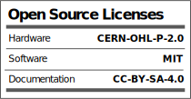

Protocentral Pulse Express with MAX30102 and MAX32664D
================================

## Don't have one? [Buy it here](https://protocentral.com/product/pulse-express-pulse-ox-heart-rate-sensor-with-max32664/)

Pulse Express is an efficient and versatile breakout board with integrated high-sensitivity optical sensors (MAX30102) and also a chip that does the calculations (biometric sensor hub MAX32664D). Integrating Maxim’s MAX32664 Version D makes Pulse Express unique, with an internal algorithm that works to measure different data as you start. With its built-in low power capability, the board is suitable for any wearable health for finger-based applications.

**Note: This device is only meant to be used for research & development purposes and is NOT to be used as a medical device. This product is not FDA, CE or FCC approved for consumer use.** 

## Hardware Setup

Connection with the Arduino board is as follows:
 
 |Max32664 pin label| Arduino Connection  |Pin Function      |
 |----------------- |---------------------|------------------|
 | SDA              | A4                  |  Serial Data     |
 | SCL              | A5                  |  Serial Clock    |
 | Vin              | 5V                  |  Power           |
 | GND              | Gnd                 |  Gnd             |
 | MFIO Pin         | 05                  |  MFIO            |
 | RESET Pin        | 04                  |  Reset           | 

## Visualizing Output

[Pulse Express with MAX30102 and MAX32664D Documentation](https://docs.protocentral.com/getting-started-with-PulseExpress)

License Information
===================

This product is open source! Both, our hardware and software are open source and licensed under the following licenses:

Hardware
---------

**All hardware is released under the [CERN-OHL-P v2](https://ohwr.org/cern_ohl_p_v2.txt)** license.

Copyright CERN 2020.

This source describes Open Hardware and is licensed under the CERN-OHL-P v2.

You may redistribute and modify this documentation and make products
using it under the terms of the CERN-OHL-P v2 (https:/cern.ch/cern-ohl).
This documentation is distributed WITHOUT ANY EXPRESS OR IMPLIED
WARRANTY, INCLUDING OF MERCHANTABILITY, SATISFACTORY QUALITY
AND FITNESS FOR A PARTICULAR PURPOSE. Please see the CERN-OHL-P v2
for applicable conditions

Software
--------

**All software is released under the MIT License(http://opensource.org/licenses/MIT).**

THE SOFTWARE IS PROVIDED "AS IS", WITHOUT WARRANTY OF ANY KIND, EXPRESS OR IMPLIED, INCLUDING BUT NOT LIMITED TO THE WARRANTIES OF MERCHANTABILITY, FITNESS FOR A PARTICULAR PURPOSE AND NONINFRINGEMENT. IN NO EVENT SHALL THE AUTHORS OR COPYRIGHT HOLDERS BE LIABLE FOR ANY CLAIM, DAMAGES OR OTHER LIABILITY, WHETHER IN AN ACTION OF CONTRACT, TORT OR OTHERWISE, ARISING FROM, OUT OF OR IN CONNECTION WITH THE SOFTWARE OR THE USE OR OTHER DEALINGS IN THE SOFTWARE.

Documentation
-------------
**All documentation is released under [Creative Commons Share-alike 4.0 International](http://creativecommons.org/licenses/by-sa/4.0/).**

You are free to:

* Share — copy and redistribute the material in any medium or format
* Adapt — remix, transform, and build upon the material for any purpose, even commercially.
The licensor cannot revoke these freedoms as long as you follow the license terms.

Under the following terms:

* Attribution — You must give appropriate credit, provide a link to the license, and indicate if changes were made. You may do so in any reasonable manner, but not in any way that suggests the licensor endorses you or your use.
* ShareAlike — If you remix, transform, or build upon the material, you must distribute your contributions under the same license as the original.

Please check [*LICENSE.md*](LICENSE.md) for detailed license descriptions.
